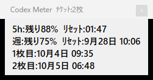

# Codex Meter

Codexの使用量、リセット時刻、リセットチケット期限を確認する、Windows用のタスクトレイ常駐ミニアプリです。OpenAI公式製品ではありません。



## 機能

- 5時間枠・週間枠の残り枠（%）とリセット時刻
- リセットチケットの枚数と、取得可能な各期限
- 有効期限が24時間以内の利用可能チケットを1回通知
- コンパクトな太字表示、タスクトレイ常駐
- Codex Desktopと同時起動するショートカット

使用量履歴、使用率警報、チケットの使用、自動アップデートはありません。

## 対応OS・必要条件

Windows 10 / 11の64bit版（x64）。.NETランタイムはインストーラーに同梱しています。
公式Codex CLIがインストールされ、Codex側でChatGPTアカウントの認証が利用できる環境が必要です。APIキー専用の環境で使用量の取得を保証するものではありません。
CLIはPATH上のcodex.exe、または標準のユーザー別npmインストール先から検出します。Codex CLIとアカウントは本アプリに同梱しません。
連携起動にはMicrosoft Store版のCodex Desktopが必要です。Meter単体でも起動できます。
macOS / Linux / Web / Android / iOSには対応していません。

## インストール・使い方

1. GitHub Releasesから `CodexMeter-Setup.exe` をダウンロードします。
2. インストーラーを実行します。通常は管理者権限不要で、自分のユーザー用フォルダに入ります。
3. スタートメニューの `Codex + Meter` で両方を起動、`Codex Meter` でMeterだけを起動できます。
4. トレイアイコンを左クリックすると使用量を表示します。右クリックの「終了」はMeterだけを終了します。

ウィンドウの×は表示だけを閉じます。Windows起動時の自動起動は設定しません。
新版は手動で再ダウンロードし、Meterを終了してから同じ場所へインストールしてください。
アンインストールはWindowsの「インストールされているアプリ」から行えます。
通知済み状態はインストール先の `state/notified.json` に保存し、更新やアンインストールで削除しません。使用量履歴は保存しません。

## SmartScreen

現在のWindows版はコード署名を行っていないため、初回起動時にWindows SmartScreen等の警告が表示される場合があります。配布元とファイル名を確認してください。本アプリはWindowsの保護機能や実行ポリシーを変更しません。

## データと制約

公式 `codex app-server --stdio` の `account/rateLimits/read` を使用し、起動時・表示時・5分ごとに取得します。認証は公式Codex側に任せ、認証ファイルやCookieを直接読みません。
残り枠は公式の使用率を100%から差し引いて表示します。取得失敗・欠損は取得不能表示とし、0や前回値に置き換えません。チケットが0枚の場合はチケット表示を隠します。
独自サーバー、テレメトリ、使用量や認証情報の送信はありません。公式Codexが自身のサービスに接続するため、利用にはインターネットが必要です。

更新は最大約5分遅れる場合があります。Windows設定やスリープにより通知を表示できない場合があります。
重複防止のため通知前に通知済み状態を保存します。保存直後の異常終了では通知が届かない可能性があります。
チケット詳細を取得できない場合は期限を推測せず、通知もしません。状態ファイルを削除すると重複防止は引き継げません。

## 開発・配布

.NET 10 SDKとInno Setup 6でビルドします。アプリに外部NuGetライブラリは追加していません。

```powershell
.\Build.ps1
.\Build-Installer.ps1 -IsccPath 'C:\Program Files (x86)\Inno Setup 6\ISCC.exe'
```

配布物は `artifacts/release/CodexMeter-Setup.exe` と `SHA256SUMS.txt` です。バージョンは `CodexMeter.csproj` とGitタグで管理し、ファイル名は固定です。
`v1.0.0` 形式のタグをpushすると、Windows上でテスト・自己完結ビルド・インストーラー生成を行い、ドラフトReleaseに添付します。内容を確認して公開したReleaseがlatest downloadの対象になります。
公開は [RELEASE.md](RELEASE.md) の手順に従ってください。

## 公開前のプライバシー確認

この公開リポジトリでは、個人メールアドレス、ユーザー固有のローカルパス、秘密鍵、代表的な認証トークンをコミット前・push前・GitHub Actionsで検査します。初回は次を実行してください。

```powershell
.\scripts\install-git-hooks.ps1
```

手動確認は `node .\scripts\check-public-privacy.mjs --all` で実行できます。詳しくは [SECURITY.md](SECURITY.md) を参照してください。

## License

Codex Meterのオープンソースライセンスは未設定です。ソースの閲覧可能性は、再配布・改変等のライセンス許諾を意味しません。
同梱.NETランタイムのライセンスと第三者通知はインストール先の `licenses/` に含まれます。
インストーラー生成には [Inno Setup](https://jrsoftware.org/) を使用しています。
